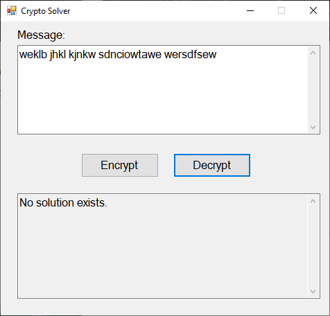

# Crypto Solver
A cryptogram is a short encrypted message that has usually been encrypted with a substitution cipher (where all the a’s were replaced by some other letter, all the b’s were replaced by a different letter, etc.)  

For example, “wikiki” might be a cryptogram for “banana” (where ‘b’ was replaced by ‘w’, ‘a’ was replaced by ‘i’, and ‘n’ was replaced by ‘k’). We say that the cryptogram is the ciphertext, or the encrypted message. We say that the original message (“banana”, in this case) is the plaintext or the decrypted message.  

In this assignment, you will write a program that will solve short cryptogram puzzles.  The GUI has been provided.

Read through the entire instructions before beginning to code; later sections may illuminate earlier passages.

## Program Description
At start up, the *form_load* event, the program should first read in the dictionary file (which is included as a project resource). If there is an error reading in the dictionary file, it should display a MessageBox with a descriptive error message, and then exit the program. You can generate the event by double-clicking the form, or assign it through the form's event-properties.  

If the file has been correctly read, it should display the following GUI:  

#### Encrypting a Message
The user can either type a cryptogram or a plaintext message in the top text box (using only spaces and lower-case letters).  

If the user types a message and clicks Encrypt  

Then the program will first check to see that the message contains only lower-case letters and spaces, and that all words in the message are in the dictionary (which is true for the message above).  

The program uses a random substitution cipher; because of this your encoding may have different letter-substitutions.

#### Decrypting a Message
If the user then tries to decrypt the resulting encrypted message above, by copying and pasting it to the message window, they will get:  

Notice that some of the words are different from the original message, because there were multiple possible decryptions. This program will display the FIRST decryption it finds that contains all dictionary words.  

Below, the user encrypts another message:  

And then decrypts the resulting ciphertext:  

#### Invalid Messages
If the user tries to encrypt a message that does not contain all dictionary words, then an error message is displayed in the result box:  

If the user includes characters other than lower-case letters or spaces, they see a different error message in the result box:  

Similarly, if characters other than lower-case letters or spaces are in a message to decrypt, we get the same error message:  

Finally, if the user enters a message to decrypt and no solution is found, they see the following error message:  

## Program structure

To complete this assignment, you will need to complete five classes and one interface:
*	UserInterface - implements the GUI, and is responsible for all interactions with the user
*	ITrie interface – defines a trie
*	TrieWithNoChildren – implements a trie with no children
*	TrieWithOneChild – implements a trie with exactly one child
*	TrieWithManyChildren – implements a trie with more than one child
*	SubstitutionCipher – encrypts and decrypts messages with a substitution cipher  

The details of these classes, including required fields, properties, and methods, are listed below.  You may add other private methods if you feel they improve the code; however, you may not add any other classes, fields, properties, or public methods. In all of your code, must follow the naming conventions, as well as the other style requirements, for this class.

Finally, you are ONLY allowed to use a try/catch when reading the dictionary file in SubstitutionCipher’s ReadDictionary method (see below for details). If you use try/catch blocks anywhere else, you will lose points.

### The Trie classes
First paste-in either your own Trie-implementations from Lab-22 or the Model Solution's. Just paste the **body** of the class into the files provided.  

Note: We advise against copying files-into-directories.  Visual Studio sometimes just places something like a symbolic link to the original file instead of creating a copy.  This will work fine on the original computer and create chaos with anything cloned from GitHub; like your solution will be cloned for grading. Be careful not to overwrite the namespace (Net6CryptoSolver).  

You will then edit the included ITrie interface. Add the method header:

bool WildcardSearch(string s);

You will need to implement this method in every Trie class (TrieWithNoChildren, TrieWithOneChild, and TrieWithManyChildren) as follows:

This method accepts strings that include wildcard characters (‘?’). The method should return true if the trie contains any word that matches s (where ANY character can match the ‘?’ characters), and false otherwise. For example, if s was “?a?a?a”, then WildcardSearch should return true because “banana” (and possibly other words) is a word in the trie and matches that wildcard search, since each ‘?’ can be matched by any letter. If the argument passed in is null, throw an ArgumentNullException.

### The SubstitutionCipher Class
The SubstitutionCipher class should handle encrypting and decrypting a message with a substitution cipher. It should contain the following private fields:  
*	Random _generator, which is initially a new Random object (use the no-argument constructor for Random, which will seed the random number generator to the system clock time)

*	ITrie _words, which is initially a new TrieWithNoChildren

And the following methods:
*	private bool AllWords(string msg) – Checks whether all words in msg are in the dictionary (the _words trie)

*	public string Encrypt(string msg) – Applies a random substitution cipher to encrypt msg, and returns the resulting ciphertext. Encrypt can assume that msg will be just lower-case letters and spaces.
    * First come up with a cypher that maps a cypher-letter to each plain-text letter in the message. Each cypher-letter can represent 0 or 1 plain-text letter.  You will be using [Random.Next(int maxValue)](https://learn.microsoft.com/en-us/dotnet/api/system.random.next?view=net-6.0) to  "pick" the cypher-letter.  You will need a data structure to hold the (plain-letter, cypher-letter) pairs as well as a way to ensure each cypher-letter is used at most once. One way is to keep track of the characters used.  When you need the next cipher-letter, keep generating new ints until you generate a value that is not "in" the used-list.
    * Then you will use the cypher to encode the plain text.  

*	public bool ReadDictionary(string fileName) – Reads the fileName input file of allowable words and adds them to the _words trie. This method returns whether the file was successfully read.

*	public bool ContainsInvalid(string msg) – Returns whether msg contains characters other than lower-case letters or spaces.

*	private bool PossibleCompletion(StringBuilder[] plain) – Returns whether the words in plain have possible completions in the _words trie. Each entry in plain will be a partially completed word, with ? at the positions that have not been assigned.

*	public bool Solved(StringBuilder[] plain) – Returns whether the words in plain are a completed decryption (with no ? characters and with the _words trie containing all the words)

*	private int[]? NextPosition(StringBuilder[] plain) – Returns a size-2 array of the position of the next ? character in plain (position 0: the index of the first word in plain with a ?, and position 1: the index of the first ? within that word).  If there are no wildcards return null.

*	private void Substitute(char orig, char replace, string[] cipher, StringBuilder[] plain) – For all occurrences of orig in cipher, substitutes the corresponding position with replace in plain

>  Assume you call the method where the arguments are orig = 'n', replace = 'a', cipher ={"fnj", "wnj"} and plain = {{"b", "?", "?"},{"?", "?", "?"}}.  
> **Leaving** the method, plain is now = {{"b", "a", "?"},{"?", "a", "?"}}.   

*	private bool DecryptionSearch(string[] cipher, StringBuilder[] partial, bool[] alphaUsed) – performs a recursive search to solve the cryptogram. See below for details on the algorithm.

*	public string Decrypt(string msg, out bool solved) – Decrypts msg and returns the first possible solution. solved is set to whether or not a solution was found.
    * Decrypt should first break msg into an array of words. It should then create an array of StringBuilders whose length is the same as the number of words in msg. Each StringBuilder should be a sequence of x ? characters, where x is the length of the corresponding word in msg.
    * Decrypt should then call DecryptionSearch with the array of words, the array of StringBuilders, and a size-26 bool array that is all false.

### The UserInterface Class

UserInterface should represent the user interface for the project. It should contain the following private fields:
* SubstitutionCipher _cipher, which is initially a new SubstitutionCipher object

UserInterface should also contain the following methods:
*	Load event for the form – calls ReadDictionary on _cipher to read in the words, passing ”..\\..\\..\\data\\dictionary.txt” as the file name. (The dictionary.txt file is included in the starter repository in the data folder.) If there was an error reading the dictionary, it displays a MessageBox with an error message and exits the program. If an exception occurs while reading the file or loading the dictionary, print a MessageBox with the error and exit the program.

*	Click event for the Encrypt button – It should use both ContainsInvalid and AllWords from SubsitutionCipher to check for errors, and should then call Encrypt in SubstitutionCipher to encrypt the message in the top text box.
    * If the user clicks the Encrypt button, the program should first check whether the message in the top text box contains characters other than lower-case letters or spaces. If it does, then the error message “Error: Invalid characters. Only lowercase letters and spaces allowed.” should be placed in the bottom text box.
    * The program should then check whether all words in the message are in the dictionary file. If any of them are not, then the message “Error: not all words are in the dictionary.” should be placed in the bottom text box.
    * If no errors occurred, the program should apply a random substitution cipher to the message and should place the resulting ciphertext (the encrypted message) in the bottom text box.

*	Click event for the Decrypt button - It should use both ContainsInvalid from SubsitutionCipher to check for errors, and should then call Decrypt in SubstitutionCipher to decrypt the message in the top text box.  
    * First check whether the message in the top text box contains characters other than lower-case letters or spaces. If it does, then the error message “Error: Invalid characters. Only lowercase letters and spaces allowed.” should be placed in the bottom text box.
    * If all characters are valid, the search for a possible solution to the ciphertext in the top box where all resulting words are in the dictionary file. It should place the FIRST such solution it finds in the bottom text box.
    * If no solution is found, the program should place the error message “No solution exists.” in the bottom text box.

### The DecryptionSearch method from SubstitutionCipher
The DecryptionSearch method in SubsitutionCipher will perform a recursive search to try all possible combinations of letter substitutions to solve the cryptogram. As it searches, it will use the trie’s WildcardSearch method to ensure that any partially filled words have possible matches in the dictionary.  

DecryptionSearch takes the following parameters:  
*	string[] cipher – the words of the encrypted message

* StringBuilder[] partial – the current partial solution to the cipher, where each element corresponds to the current partial solution of the corresponding element in cipher. Words in partial will have ? for characters that have not been decrypted yet, and will have lowercase values for characters that have been decrypted. The values in partial will be consistent as a possible solution to the cipher (so if two of the same letters appear in cipher, and those corresponding letters have been decrypted in partial, they will have the same decrypted values).

*	bool[] alphaUsed – a size-26 array that keeps track of which lowercase letters have been used in the decryption. Spot 0 corresponds to ‘a’, spot 1 corresponds to ‘b’, etc. For each non-‘?’ character in partial, that corresponding position in alphaUsed will be true.

DecryptionSearch should then use the following algorithm:
* If partial represents a solved puzzle (i.e. it contains no ? characters, and each StringBuilder is a word in the trie), it will return true.
* Otherwise, if any word in partial does NOT have a possible match in the trie (call its WildcardSearch method), return false.
* Otherwise, extend the recursive search by finding the first location of a ‘?’ in the StringBuilders in the partial array (word index and character position within the word). Get the ciphertext value, v, (in cipher) at that same word and character position. Then for each unused lowercase letter, ‘l’ (consult alphaUsed), use the Substitute method to replace the appropriate locations in partial with ‘l’ (i.e., replace the characters at locations in which cipher contains v). Recursively call DecryptionSearch with that substitution, and then if necessary, backtrack by undoing the recent substitution.  
    *   To backtrack, set the index in alphaUsed to false and call Substitute to replace 'l' with '?'.

Make use of your helper methods (Subsititute, NextPos, Solved, and PossibleCompletion)!

## Testing
When you are ready to test your program, open the TrieTests.cs and CipherTests.cs files in the KSU.CIS300.CryptoSolver.Tests project. Each of these files include test cases that have been commented out using /* … */ tags. (The test cases were commented out so they wouldn’t cause build errors before your code was finished.)

Uncomment the tests cases in both TrieTests.cs and CipherTests.cs, run them, and ensure that they all pass. Additionally, make sure your program works correctly on all the test cases shown in the “Sample Walkthroughs” section of this document. We also recommend testing your program on your own sample messages (first encrypting them and then decrypting them).

### Performance
All of the test cases should finish within the allotted two seconds, and all of the tests in the “Sample Walkthroughs” section should also finish in less than a couple of seconds each. On your own messages, you may encounter some cases that take much longer to decrypt, such as a very short message whose words contain a lot of unique letters. This is to be expected. In general, your program will behave the fastest when decrypting messages with more words and with more common letters among the different words.  

Encryption should always appear nearly instantaneous, no matter the length of the message.  

#### Submitting Your Solution
Be sure to commit and push all your changes to your GitHub repository. Submit the entire URL of the commit that you want graded.

Note: UNLIKE lab, GitHub will not re-run the unit tests.  The green "check" you see refers to GitHub logging a push time.  It has no connection to the functionality of your project.  Automatically generated emails from GitHub or GitHub-Classroom referencing "passing" the test refer to time-logging not your project's functionality.
